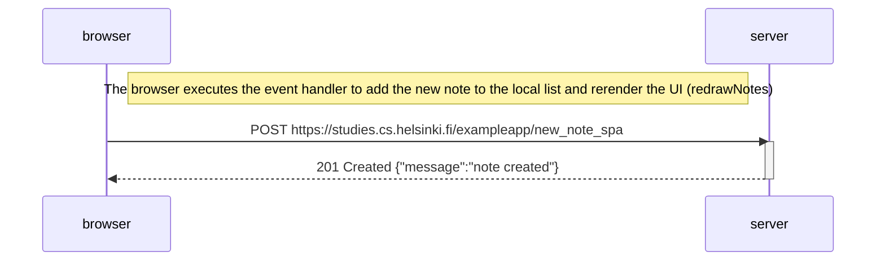

```mermaid
sequenceDiagram
    participant browser
    participant server

    Note right of browser: The browser executes the event handler to add the new note to the local list and rerender the UI (redrawNotes)

    browser->>server: POST https://studies.cs.helsinki.fi/exampleapp/new_note_spa
    activate server
    server-->>browser: 201 Created {"message":"note created"}
    deactivate server
```
